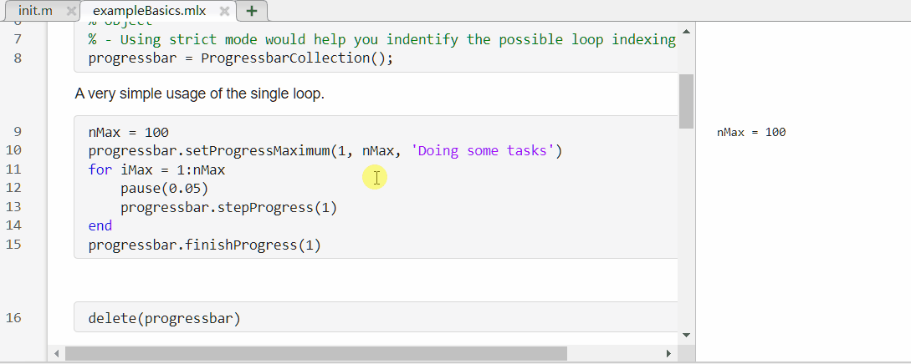
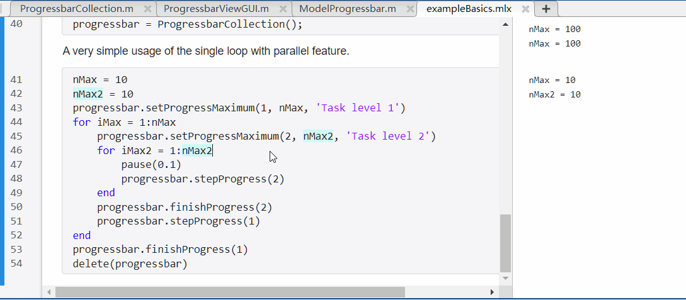

# Matlab Progressbar Collection

In short: A intuitive matlab progressbar class aimed for interfacing different view frontends with same intuitive usage.

[](https://github.com/hwyao/matlab-progressbar-collection/actions/workflows/workflow.yml)
[](https://codecov.io/gh/hwyao/matlab-progressbar-collection)

## Features

- [x] Same control interfaces supporting different progressbar view.
  - [ ] (CLI) JAAdrian's [MatlabProgressBar](https://github.com/JAAdrian/MatlabProgressBar) support.
  - [x] (GUI) Matlab [uiprogressdlg](https://www.mathworks.com/help/matlab/ref/uiprogressdlg.html) support. 
- [x] Warning features for calling mismatch (e.g. maximum value of loop not reached).
- [x] Parallel loop support.
- [x] Nested loop support.
- [x] Unit testing for ensuring code behavior and quality.
- [ ] Add parameters to control and reduce the display refresh frequency.
- [ ] Automatically start a new GUI window when it is closed unexpectedly.

## Usage

1. Clone the repository.
2. Load the project file.
3. Now we have class `ProgressbarCollection()` that manages the progressbar.


## Usage Example 

See files in [examples](https://github.com/hwyao/matlab-progressbar-collection/blob/main/examples) folder. Some important usage is listed below.

**Simple loop example**
```Matlab
progressbar = ProgressbarCollection();

nMax = 100
progressbar.setProgressMaximum(1, nMax, 'Doing some tasks')
for iMax = 1:nMax
    pause(0.05)
    progressbar.stepProgress(1)
end
progressbar.finishProgress(1)
delete(progressbar)
```


**Indeterminate example**
```Matlab
progressbar = ProgressbarCollection();

progressbar.setProgressMaximum(1, 0, "Don't know how much tasks we have")
pause(1)
progressbar.stepProgress(1, 0, 'Doing task 1 ...')
pause(1)
progressbar.stepProgress(1, 0, 'Doing task 2 ...')
pause(1)
progressbar.stepProgress(1, 0, 'Doing task 3 ...')
pause(1)

progressbar.finishProgress(1)
delete(progressbar)
```


**Multiple level example**
```Matlab
progressbar = ProgressbarCollection();

nMax = 10
nMax2 = 10
progressbar.setProgressMaximum(1, nMax, 'Task level 1')
for iMax = 1:nMax
    progressbar.setProgressMaximum(2, nMax2, 'Task level 2')
    for iMax2 = 1:nMax2
        pause(0.1)
        progressbar.stepProgress(2)
    end
    progressbar.finishProgress(2)
    progressbar.stepProgress(1)
end
progressbar.finishProgress(1)
delete(progressbar)
```


## Unit tests

Unit tests are used for behaviour and quality support. It could be also worked as some kind of documentation since it is recording the expected behaviour.

If you would like to run it locally for some reason, after loading the project, you can either [use project GUI](https://www.mathworks.com/help/matlab/matlab_prog/identify-and-run-tests-in-projects.html), [Code Quality Dashboard](https://www.mathworks.com/help/matlab-test/ref/codequalitydashboard-app.html) or type the command:
```
runtests
```
to run the unit tests.

## Design Concept

tbd

## License

MIT License

Copyright (c) 2024 Haowen Yao

Permission is hereby granted, free of charge, to any person obtaining a copy
of this software and associated documentation files (the "Software"), to deal
in the Software without restriction, including without limitation the rights
to use, copy, modify, merge, publish, distribute, sublicense, and/or sell
copies of the Software, and to permit persons to whom the Software is
furnished to do so, subject to the following conditions:

The above copyright notice and this permission notice shall be included in all
copies or substantial portions of the Software.

THE SOFTWARE IS PROVIDED "AS IS", WITHOUT WARRANTY OF ANY KIND, EXPRESS OR
IMPLIED, INCLUDING BUT NOT LIMITED TO THE WARRANTIES OF MERCHANTABILITY,
FITNESS FOR A PARTICULAR PURPOSE AND NONINFRINGEMENT. IN NO EVENT SHALL THE
AUTHORS OR COPYRIGHT HOLDERS BE LIABLE FOR ANY CLAIM, DAMAGES OR OTHER
LIABILITY, WHETHER IN AN ACTION OF CONTRACT, TORT OR OTHERWISE, ARISING FROM,
OUT OF OR IN CONNECTION WITH THE SOFTWARE OR THE USE OR OTHER DEALINGS IN THE
SOFTWARE.